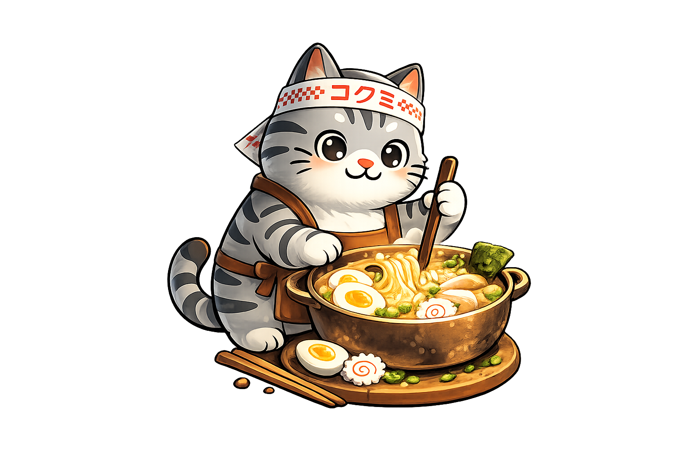

  

<h1 align="center">Kokumi</h1>

  <em>
    Kokumi (/koʊkuːmi/, Japanese: コク味, from コク “richness” + 味 “taste”) means "heartiness" or
    "richness" — subtle compounds that enhance and harmonize flavors.
      
    Kokumi applies this idea to platform delivery: Menus offers options to
    choose from, Recipes define rendering instructions, and Orders execute 
    delivery intent. Preparations produce immutable artifacts, and Servings
    activate a selected preparation.
  </em>

---

# Overview

**Kokumi** is a Kubernetes operator for structured, immutable release management.
It draws a hard line between three concerns that most delivery systems conflate:

- **Intent** — what should be built and how (the Order)
- **Artifact** — what was built, exactly (the Preparation)
- **Activation** — what is currently running (the Serving)

By keeping these separate and immutable at the artifact layer, your platform team can:

- **Gate on human approval** before a rendered artifact ever reaches a cluster.
- **Inspect the full rendered manifest** in the built-in UI before promoting.
- **Roll back instantly** by selecting any previous Preparation — the artifact
  already exists, no re-render required.
- **Operate in restricted networks** — the entire pipeline works offline; all
  dependencies are OCI artifacts that can be mirrored in advance.
- **Detect drift unambiguously** — compare the deployed SHA-256 digest to the
  desired one; any mismatch is a concrete, actionable signal.

Kokumi supports both **Helm charts** and **pre-rendered manifest bundles** as
OCI source artifacts, and delegates all runtime deployment to **Argo CD** —
feeding your existing GitOps workflow rather than replacing it.

## Getting Started

> **Kokumi is currently experimental — use with caution in production environments.**

Read the [Installation guide](https://kokumi.dev/docs/installation) and [Getting Started guide](https://kokumi.dev/docs/getting-started) on the docs site for full setup instructions, or explore the [Architecture & Concepts](https://kokumi.dev/docs/architecture) page to understand how the reconciliation model works before diving in.

## Core Concepts

Kokumi models release workflows using four composable CRDs.

### Menu

Menu is the reusable delivery template. It represents the base structure that
an Order can consume and parameterize per environment or rollout.

### Recipe

Recipe defines rendering behavior, such as Helm render options and related
render-time configuration.

### Order

Order is the concrete execution request. An Order declares the source OCI
artifact (a Helm chart or manifest bundle), optional patches, and rendering
configuration. It describes _what should be built_ — not a running system.
Every change to an Order triggers a new render cycle and produces a new
Preparation automatically. Optionally, an Order can consume and parameterize
a Menu template.

### Preparation

An immutable OCI artifact produced by rendering an Order at a specific point
in time. Preparations are created automatically — you never write one directly.
Multiple Preparations accumulate per Order, giving you a complete,
reproducible history of every version ever built. Promoting or rolling back
is simply a matter of pointing the Serving at a different Preparation.

### Serving

The active deployment pointer — exactly one per Order. A Serving references
one specific Preparation and creates or updates an Argo CD `Application` that
syncs that artifact into the cluster. Switching versions (upgrading or rolling
back) means updating which Preparation the Serving references; the artifact
does not change.
