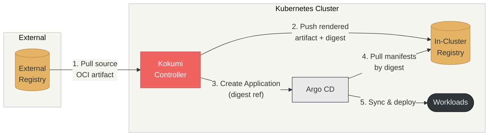

## Core philosophy

Kokumi draws a hard line between three concerns that most delivery systems conflate:

1. **Intent** — what _should_ be built and how (the Order)
2. **Artifact** — what _was_ built, exactly (the Preparation)
3. **Activation** — what is _currently running_ (the Serving)

By keeping these separate and immutable at the artifact layer, Kokumi gives
you a complete, auditable history of every version ever produced and the
ability to promote or roll back with a single field change.

## Key advantages

### Immutability at the artifact layer

A Preparation is not a live snapshot. It is an OCI artifact identified by a
SHA-256 digest. Once a Preparation reaches `Ready`, it never changes.

- Reproduce exactly what was running at any point in time by re-fetching the
  artifact by digest.
- Drift is unambiguous. Compare the deployed digest to the desired digest.
  Any difference is a concrete, actionable signal.
- Artifacts can be signed, attested, and audited independently of the cluster.

### Separation of rendering from deployment

Kokumi keeps rendering and deployment as two distinct, independently
controllable steps:

```
Render                      Promote                    Deploy
Order ──▶ Preparation ─────────────────────────▶ Serving ──▶ Argo CD Application
           (immutable)    (human or auto)           (active pointer)
```

Because the rendered artifact is stored independently:

- **Approval gates** — set `spec.promotion.approvals` to require votes from
  named reviewers before a Preparation can be served, in both Manual and
  Automatic mode. See [Approvals](#approvals).
- **Manual promotion** — set `spec.promotion.mode: Manual` to hold the
  Serving until a human explicitly promotes the Preparation.
- **Pre-flight validation** — inspect the full rendered manifest in the UI
  before it touches any cluster.

### Rollback without re-rendering

Rolling back means promoting any previous Preparation. The artifact already
exists in the in-cluster registry, so the exact state that previously ran is
restored instantly: No re-render, no drift.

### Air-gap friendly by design

The entire pipeline — OCI pull → render → push to in-cluster registry — has no
requirement for outbound internet access. All external dependencies are OCI
artifacts that can be mirrored in advance, making Kokumi suitable for
restricted and disconnected environments.

### GitOps integration, not replacement

Kokumi does not apply manifests directly and does not own a sync loop. Each
Serving creates or updates an Argo CD `Application` pointing at the
Preparation's OCI artifact by digest. Kokumi feeds your existing GitOps
workflow rather than replacing it.

## Dependencies

Kokumi requires **Argo CD** (≥ 3.3) installed in the `argocd` namespace.
When a Serving is created or updated, the Serving controller creates or updates
an Argo CD `Application` resource that points to the immutable OCI artifact of
the selected Preparation. Argo CD then syncs that artifact into the cluster.

> **Kokumi does not apply manifests directly.** All runtime deployment is
> delegated to Argo CD. Without a running Argo CD instance, Servings will
> remain in a `Failed` state and no workloads will be deployed.

## Resource model

```
Order ──renders──▶ Preparation (immutable, versioned OCI artifact)
                         ▲
Serving ──selects────────┘  (mutable pointer to one Preparation)
   │
   └──creates/updates──▶ Argo CD Application
                              │
                              └──syncs──▶ Cluster workloads

Menu ──provides template──▶ Order  (consumed and parameterized)
Recipe ──provides render profile──▶ Order  (for example Helm options)
```

### Menu

A Menu is a reusable deployment template. It pins a source OCI reference and
version, locks the render type, and defines default values and patches.
Consumers create Orders that reference a Menu instead of specifying source
details directly.

Each Menu carries an **override policy** that controls what consumers are
allowed to customise:

| Policy | Behaviour |
|---|---|
| `All` | Consumer may supply any values or patches |
| `Restricted` | Consumer may only set values or patches that match the Menu's allow-list |
| `None` | Consumer may not override values or patches at all |

Values and patches have independent policies. For example a Menu can allow
unrestricted Helm value overrides while forbidding any patches, or restrict
values to a specific list of keys while allowing all patches.

When an Order references a Menu:

1. The Order controller fetches the Menu and validates the consumer's overrides
   against the override policy.
2. Base values and patches from the Menu are always applied first.
3. Allowed consumer overrides are merged on top (values are deep-merged, patches
   are appended).
4. If the consumer supplies overrides that violate the policy, reconciliation
   fails with a clear status message.

#### Source resolution and vendoring

The Menu controller always publishes the consumable source in the Menu's
`status.source` (OCI URL, version, optional Pantry reference for pull
credentials, and the resolved digest). Orders consume exactly what is
advertised there.

Optionally, a Menu can **vendor** its source: copy the artifact (Helm chart or
manifest bundle) to another OCI registry. Orders then consume the vendored
copy:

```yaml
spec:
  source:
    oci: oci://ghcr.io/kokumi-dev/testdata/external-secrets
    version: "0.1.0"
  vendor:
    destination:
      oci: oci://kokumi-registry.kokumi.svc.cluster.local:5000/preparation/external-secrets  # or a pantryRef
```

The destination is either a plain `oci://` URL (anonymous) or a `pantryRef`
(credentials from the referenced Pantry). Upstream credentials come from
`spec.source.pantryRef` when the upstream registry is private. The vendored
ref and its pull credentials are advertised in `status.source`, so Orders need
no knowledge of the vendoring setup.

### Recipe

Recipe captures rendering configuration, including options like Helm rendering
behavior and values-related settings.

### Order

Order is the concrete execution request. It binds source and runtime input and
triggers rendering to produce immutable artifacts.

Order does not need Menu. It can fully define component intent on its own, and
this standalone behavior is intended to remain a first-class mode.

Alternatively, an Order can reference a Menu via `spec.menuRef`. When a Menu
reference is present, the source, render type, and base configuration are
inherited from the Menu. The consumer provides only the overrides that the
Menu's policy permits.

An Order declares:

- **Source** (standalone mode) — OCI image reference: either a pre-rendered
  manifest bundle (containing `*.yaml` files) or a Helm chart in OCI format
  (add `spec.render.helm` to configure rendering)
- **MenuRef** (template mode) — reference to a Menu by name in the Order's
  namespace; source and render configuration are inherited
- **Patches** — Patches to apply before producing the artifact

Orders are mutable; every change triggers a new reconciliation cycle and
automatically produces a new Preparation.

### Preparation

Preparations are **created automatically** by Kokumi whenever an Order changes.
You never create them directly.

A Preparation is the _output_ of rendering an Order at a specific point in time.
It contains:

- A reference to the parent Order and the exact source revision used
- An OCI artifact digest (stored in the in-cluster OCI registry)
- An immutable status: once `Ready`, a Preparation never changes

Preparations are **never garbage-collected automatically**. You retain full
history and can promote any old Preparation to active at any time.

#### Linking a Preparation back to its source

Every Preparation records where its base OCI artifact came from, so you can
trace any deployed version back to the exact commit or tag that produced it.
Kokumi reads provenance from the base artifact's OCI annotations and copies
them onto the rendered Preparation artifact and its CR. The primary keys are
`org.opencontainers.image.source`, `org.opencontainers.image.version`, and
`org.opencontainers.image.revision`, with
fallbacks so artifacts that omit one still link correctly:

| Annotation (base artifact) | Fallback | Preparation field | Meaning |
|---|---|---|---|
| `org.opencontainers.image.source` | `org.opencontainers.image.url` | `spec.gitSource.repo` | SCM repository URL of the base artifact's source |
| `org.opencontainers.image.version` | — | `spec.gitSource.tag` | SCM tag of the base artifact's source |
| `org.opencontainers.image.revision` | — | `spec.gitSource.commitHash` | SCM commit SHA of the base artifact's source |

Kokumi also stamps the base artifact's identity onto the rendered artifact so
the chain is verifiable from the artifact alone:

- `org.opencontainers.image.base.name` — the base artifact's OCI reference
- `org.opencontainers.image.base.digest` — the base artifact's digest

### Serving

A Serving tracks which Preparation is actively deployed. There is exactly one
Serving per Order, named after the Order, and it is **managed automatically**;
you never create one directly. The promotion mode is always read from the
Order's `spec.promotion.mode`:

- **Automatic** — Kokumi creates the Serving and always targets the newest
  `Ready` Preparation of the Order (`status.targetPreparationName`).
- **Manual** — click **Promote** on a Preparation in the Kokumi UI (or set the
  Serving's `spec.preparationName`). Rolling back is promoting an older
  Preparation.

When a Serving is reconciled, the controller:

1. Resolves the target Preparation and its immutable OCI artifact digest.
2. Enforces the approval gate of the target Preparation. If it is not
   approved, or its approvals are not sealed yet, the currently deployed
   Preparation stays active and the Serving's `Approved` condition explains
   why.
3. Verifies the opt-in on any pre-existing Argo CD `Application` and
   transitions the Serving to `Deploying`, recording the preparation as the
   observed (active) one.
4. Creates or updates the Argo CD `Application` in the `argocd` namespace,
   pointing `spec.source.repoURL` at the Preparation's OCI artifact and
   `spec.source.targetRevision` at its exact digest.
5. Keeps the `Deploying` status until the Application reports `Healthy` and
   is synced to the desired revision, then transitions the Serving to
   `Deployed`. A degraded Application surfaces as `DeploymentFailed`.

Rollback is promoting any previous Preparation. No re-rendering required.

### Approvals

An Order can require reviews before any of its Preparations is served,
similar to required reviews on a pull request:

```yaml
spec:
  promotion:
    mode: Manual            # or Automatic
    approvals:
      requiredApprovals: 2
      allowedGroups: [release-approvers]
```

- The policy is **copied into each Preparation** (`spec.approvalPolicy`) and
  recorded on its OCI artifact. Changing the policy produces a new
  Preparation that needs fresh approvals.
- Reviewers vote in the UI with **Approve** or **Request changes**. Each vote
  is an immutable `Approval` resource. Only the **latest vote per reviewer**
  counts, only reviewers in one of `allowedGroups` are eligible, and a single
  eligible "Request changes" blocks the Preparation.
- Both promotion modes are gated. In Automatic mode the newest Preparation is
  deployed as soon as it is approved; an older approved Preparation is never
  deployed in its place. In Manual mode a human still has to press Promote.
- When an approved Preparation is promoted, its votes are **sealed**: they are
  locked in `status.approval` and pushed as an in-toto attestation
  (`application/vnd.kokumi.approvals.v1+json`) that references the
  Preparation's artifact as an OCI referrer. Votes submitted later are ignored.
  List the attestation with `oras discover <artifact>`.

#### Who may vote and how identity is protected

- Votes are submitted **only through the kokumi server**, which takes the
  reviewer's identity (OIDC issuer, subject, username, email, groups) from the
  verified login session. The shared built-in admin account cannot vote.
- Whether a user may vote at all is plain Kubernetes RBAC: the custom verb
  `approve` on `preparations`, checked for the user's mapped ServiceAccount.
- The `approval-integrity` ValidatingAdmissionPolicy accepts new Approvals
  only from the `kokumi-server` ServiceAccount, rejects every update, and
  rejects deletes except by the namespace controller. The `status-integrity`
  policy lets only the kokumi controller write Approval, Preparation and
  Serving status (the Serving's target Preparation triggers sealing).
- Approvals are kept even when their Preparation or Order is deleted, so the
  history stays visible:

```bash
kubectl get approvals --field-selector spec.orderName=shop
kubectl get approvals --field-selector spec.preparationRef.name=shop-3f9a1c2d4e5f
```

The admission policies protect against everyone except cluster administrators
who can change the policies themselves, impersonate the `kokumi-server`
ServiceAccount, or write to etcd directly. Restrict those permissions and keep
an audit policy on `approvals` and `admissionregistration.k8s.io` resources.

### Menu and Recipe lifecycle

Recipe defines rendering behavior. Menu provides a reusable template with
override policies controlling what consumers can customise.
Order remains the concrete execution resource, whether standalone or template-
parameterized.

## Reconciliation loop

```
Watch Order ──▶ Render source ──▶ Push OCI artifact ──▶ Create/update Preparation
                                                                   │
Watch Preparation status ──────────────────────────────────────────▼
Serving selects Preparation ──▶ Create/update Argo CD Application
                                        │
                                        └──▶ Argo CD syncs manifests to cluster
```

Key properties:

- **Idempotent** — each reconcile produces the same output for the same input
- **Level-triggered** — the controller always acts on observed state, not events
- **Owner references** — Preparations are owned by their Order; clean deletion is automatic
- **Argo CD delegates deployment** — Kokumi never applies manifests directly; it only manages the Argo CD Application resource

## OCI source formats

Kokumi supports two source OCI artifact formats, selected by the presence or
absence of `spec.render`.

### Pre-rendered manifest bundle (default)

When `spec.render` is absent, the source OCI artifact must contain one or more
`*.yaml` files at its root holding all Kubernetes resources (single or multi-
document YAML). The files are stored as-is, with no rendering step applied.

Supported layouts include:

**Single manifest file**
```
myapp:v1.0.0  (OCI artifact)
└── manifest.yaml   ← all Kubernetes resources (pre-rendered)
```

**Multiple manifest files**
```
myapp:v1.0.0  (OCI artifact)
|── deployment.yaml   ← Kubernetes Deployment
└── service.yaml      ← Kubernetes Service
```

This is the simplest format and is well-suited to components whose manifests
are already generated upstream and published as OCI bundles.

### Helm chart in OCI format

When `spec.render.helm` is present, the source OCI artifact must be a standard
Helm chart packaged and pushed to an OCI registry (e.g. via `helm push`).
Kokumi runs `helm template` internally to render the chart into a manifest
bundle, then stores the output as an immutable Preparation artifact.

```yaml
spec:
  source:
    oci: oci://ghcr.io/stefanprodan/charts/podinfo
    version: "6.10.2"
  render:
    helm:
      namespace: default
      values:
        ui:
          color: "#EF6461"
          message: "Hello from Kokumi"
          logo: "https://kokumi.dev/images/logo.png"
```

Available `render.helm` fields:

| Field | Description | Default |
|---|---|---|
| `releaseName` | Helm release name passed to `helm template` | Order name |
| `namespace` | Target namespace (`--namespace`) | Order namespace |
| `includeCRDs` | Include CRDs in the rendered output (`--include-crds`) | `false` |
| `values` | Inline Helm values merged last (highest priority) | — |

Helm OCI charts are first-class in Kokumi. Any chart published to an OCI
registry, whether an upstream community chart or an internally-built one,
can be used as an Order source.

## OCI registry

Kokumi ships an in-cluster OCI-compatible registry (backed by a `PersistentVolumeClaim`)
that stores rendered manifests as OCI artifacts. This means:

- Zero external registry dependency
- Rendered manifests are portable: pull them with any OCI client
- Artifact digests are content-addressed; deduplication is automatic

## Deployment architecture

Kokumi pulls a source artifact from a registry, renders it into an immutable artifact, and stores it in a destination registry. Argo CD then fetches the manifests by content digest and syncs them to the cluster. The source OCI reference on the Order accepts any registry (including the in-cluster one), and the destination defaults to the in-cluster registry when omitted but can be set to an external registry instead.


